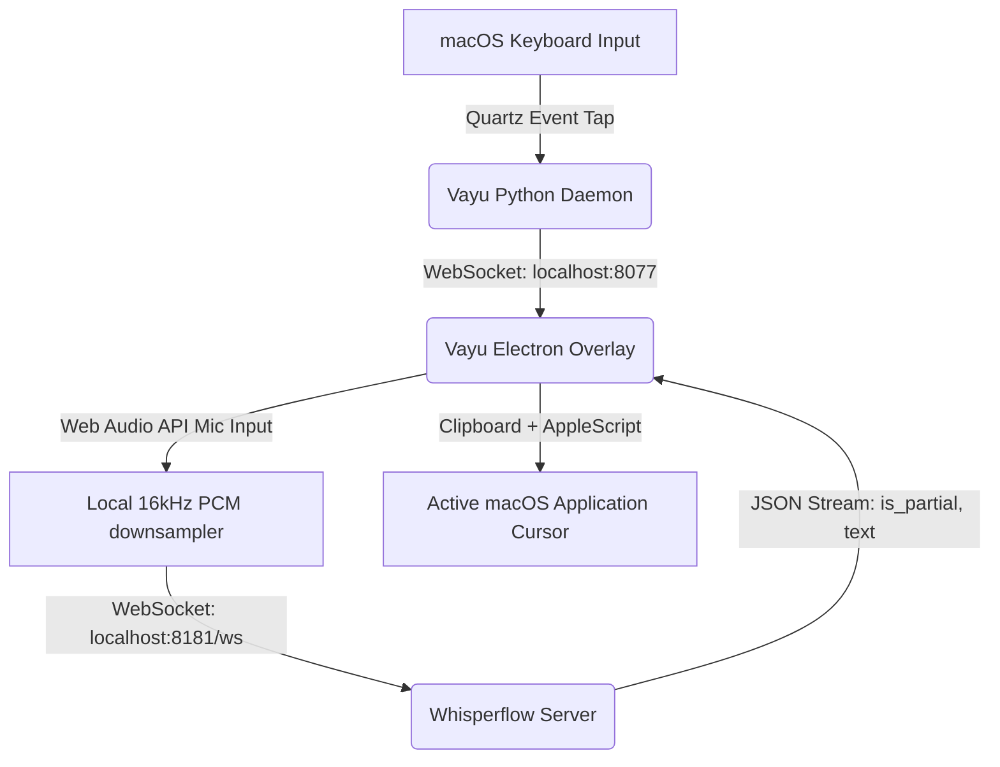

# Vayu Single Canonical Design (DESIGN.md)

Vayu is a real-time global voice dictation overlay utility for macOS. It binds hardware audio input downsampling, local streaming speech-to-text transcribers, WebGL chromatic wave visualizers, and system clipboard text injection.

---

## 1. Architectural Topology



---

## 2. Component Design & Boundaries

### A. Hotkey Daemon (`daemon.py`)
*   **Role:** Passive keyboard monitor.
*   **Dependencies:** `pynput` utilizing Apple's `ApplicationServices` / `Quartz` APIs.
*   **Trigger:** Holds `CMD` + `Control` keys.
*   **API Protocol:** Hosts a local WebSocket server at `ws://localhost:8077` and broadcasts:
    *   `{"event": "keydown"}` on trigger down.
    *   `{"event": "keyup"}` on trigger up.

### B. Overlay Window (`main.js` & `index.html`)
*   **Window Bounds:** 400px x 180px, positioned center-bottom above the Dock.
*   **Aesthetics:** 24px backdrop blur, dark glassmorphic panels (`rgba(10, 10, 12, 0.72)`).
*   **Input Handling:** Click-through enabled (`mainWindow.setIgnoreMouseEvents(true)`).
*   **Audio Pipeline:**
    *   Web Audio captures mic stream.
    *   `AnalyserNode` extracts RMS frequency levels to drive the shader amplitude.
    *   `ScriptProcessorNode` downsamples float32 stream to 16-bit PCM at 16000Hz.
    *   ArrayBuffers are streamed to `ws://localhost:8181/ws`.

### C. WebGL Siri-style Chromatic Wave
*   **Mathematics:** Restores iOS 27 Lorentzian glows (`1 / (d^2 + s^2)`) and spectral color dispersion (`spectral4(s)`).
*   **Volume Driving:** An Exponential Moving Average (EMA) visual filter prevents jitter:
    ```javascript
    volumeVal = volumeVal * 0.82 + targetVolume * 0.18;
    ```

### D. System Paste Injection
*   **Protocol:** On `keyup`:
    1.  Electron clipboard writes final transcribed text string.
    2.  Spawns AppleScript via Node `child_process.exec`:
        ```bash
        osascript -e 'tell application "System Events" to keystroke "v" using command down'
        ```
    3.  Fades overlay out and hides the window.
