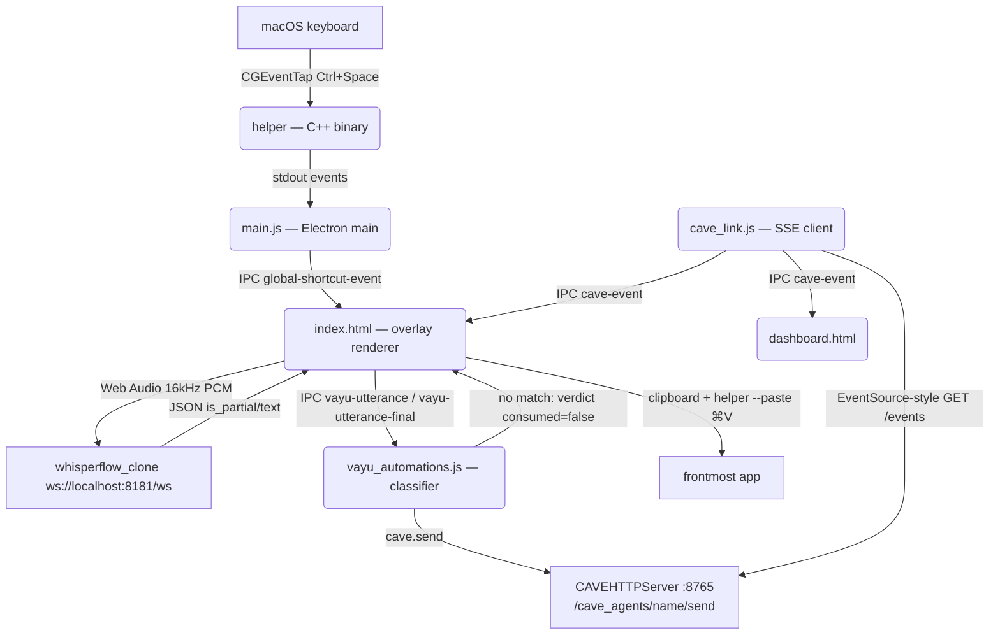

# Vayu Single Canonical Design (DESIGN.md)

Vayu is a real-time global voice dictation overlay for macOS — and a voice **ingress into CAVE**.
It binds a native CGEventTap hotkey helper, local streaming Whisper transcription, a WebGL
chromatic wave + glass-sky word overlay, system paste injection, and an automation classifier
that routes command utterances onto the CAVE event bus. (Updated 2026-07-04.)

---

## 1. Architectural Topology

**The split that matters: Vayu classifies, CAVE automates.** Vayu owns exactly one piece of
automation logic — the regex table mapping utterance text → route (`automations.yaml`). All
agentic reaction lives server-side in CAVE's `Automations()` (`EventAutomation` /
`AutomationRegistry` in cave-harness). Do NOT grow an automation engine inside Vayu.

---

## 2. Component Design & Boundaries

### A. Hotkey Helper (`helper.cpp` → `helper`)
* Native CGEventTap binary (rule-17 devflow): non-blocking tap callback sets volatile
  state; a 16ms CFRunLoopTimer polls and writes events to stdout asynchronously.
* Ctrl+Space: hold >450ms = push-to-talk (stop on release); tap = toggle mode.
* Bundled at `Vayu.app/Contents/MacOS/helper`, signed with the same identity
  ("Vayu Local Code Signing") so TCC Accessibility grants persist across rebuilds.
* Also performs paste: `helper --paste` posts ⌘V via CGEventPost.

### B. Overlay Window (`main.js` + `index.html`)
* **Window:** `min(1000, screen−80)` × 384, bottom-center, transparent, `acceptFirstMouse`.
* **Visibility/click-through:** `show-window` → `setIgnoreMouseEvents(false)` (interactive
  while visible); `hide-window` → restores click-through unconditionally (hiding while
  hovered would otherwise leave a hidden window eating clicks).
* **Layout:** status pill row (Listening · word count · **Open Vayu** tab → dashboard) docked
  to the top-right of the **glass sky** — a rounded glass pane where words write left-to-right
  and ACCUMULATE (never blown away; page scrolls to follow). Weather (clouds + leaves) drifts
  behind the words inside the pane. Below: the full-width WebGL wave.
* **Transcript accumulator** (the server contract, see §C): a partial REPLACES the current
  partial (whole-segment re-transcription revises earlier words); `is_partial:false` commits
  the segment. `transcribedText = committed ⊕ partial`. Spans are reconciled in place by index
  so unchanged words never flicker. Tests: `scripts/test_transcript_accumulator.js`.
* **Audio:** ScriptProcessorNode downsample → int16 PCM 16kHz → ws://localhost:8181/ws.
  Volume envelope: fast attack / slow decay driving the shader (`uVolume`).

### C. Transcription Server (`whisperflow_clone`, FastAPI :8181)
* Tumbling buffer; whole-buffer re-transcribe per ~250ms of new audio; segment closes on
  2 stable passes OR ≥0.6s trailing silence OR 15s cap → buffer flush.
* **Voiced gate (2026-07-04):** buffers with <0.25s of non-silent audio are never
  transcribed — kills whisper tiny.en's silence hallucination ("Thank you.").
* Launch: `whisperflow_clone/run.sh -server` (uvicorn, own .venv).

### D. Automations (`vayu_automations.js` + `~/Library/Application Support/Vayu/automations.yaml`)
* YAML route table, hot-reloaded via fs.watch; seeded with defaults on first run.
* Route: `{name, match (regex, case-insensitive), on: paste|final, action, args, consume}`.
  First match wins. `consume: true` = the utterance is a COMMAND: saved to transcripts
  (tagged `command`) but NOT pasted.
* Actions: `open_dashboard` · `cave.send` (agent name lowercased) · `shell` · `http`.
* Trigger points: `on: paste` = full utterance at stop (renderer awaits the verdict);
  `on: final` = per closed segment mid-dictation (fire-and-forget).
* **Wake word (`{wake}` token):** the model is English-only (`tiny.en`) and physically
  cannot transcribe the out-of-vocab name "vayu" — it snaps to the nearest real word
  ("vite", "value", "bayou", "via"). So no route hardcodes "vayu"; they use the `{wake}`
  placeholder, expanded at regex-compile time to a case-insensitive alternation over every
  accepted spoken/mis-transcribed form. The set is the `wake:` list in automations.yaml
  (defaults in `DEFAULT_WAKE`); add a line if your voice trips a form not listed. This is
  the wake-word analogue of the `contacts:` alias list used for agent names. Longest form
  wins (alternation sorted by length). Tests: `scripts/test_automations.js` (§2b).

### E. CAVE Link (`cave_link.js`)
* Mirrors the canonical frontend↔CAVE shapes (agent-control-panel pattern):
  publish `POST {base}/cave_agents/{agent}/send {message, ingress:"frontend"}`;
  subscribe `GET {base}/events` (SSE, payloads carry `event_type`/`data`).
* Config under `cave:` in automations.yaml (`base_url`, default http://localhost:8765;
  `enabled`). Degrades gracefully: reconnect backoff 5s→60s; Vayu works standalone.
* Incoming events are logged (`cave event <type>`) and forwarded over IPC `cave-event`
  to the overlay + dashboard renderers.
* ASPIRATIONAL: surface `llm_response` events on the glass sky / dashboard; correlate
  request→response via gateway sessions (`cave_gateway` OpenAI-compat seam) — see the
  CAVE-archi decision: (B) `VayuChannel(UserChannel)` as a registered Nadi, (C) gateway
  `/v1/chat/completions` for inherent request/response pairing.

### F. Dashboard (`dashboard.html`)
* Zen landing per the floating-islands mockup: sky background, centered glass card
  (VAYU wordmark, ⌘K search, History/Settings pills), top-right orbs; the latest
  dictation rides an animated SVG **ribbon** (textPath marquee, click-to-copy).
* History sheet = transcript feed + tag filters + Insights (tag stats); Settings sheet =
  shortcut/engine/storage info + open-folder. Data via `db.js` (YAML transcripts in
  `~/Library/Application Support/Vayu/transcripts/`), tags via `tagger.js`.

### G. WebGL Wave (`index.html` shaders)
* Lorentzian glow + spectral4 dispersion; amplitude/intensity bound to `uVolume`;
  full-DPR canvas resize.

---

## 3. Build & Package
* `npm run package-mac` (rule-17): clang-compile helper → electron-packager (darwin/arm64)
  → overwrite `/Applications/Vayu.app` → inject helper → codesign (persistent local identity).
* Deps: `electron` + `js-yaml` (automations config only). Tests:
  `scripts/test_transcript_accumulator.js`, `scripts/test_automations.js`.
* Logs + data: `~/Library/Application Support/Vayu/` (`vayu_runtime.log`, transcripts,
  automations.yaml). The workspace-dir logs are LEGACY (pre-DATA_DIR builds).
